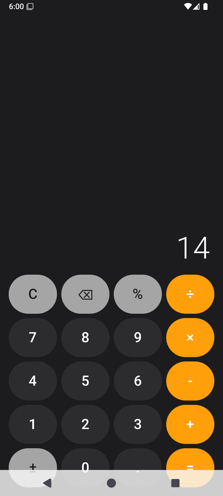

# Calculatrice Android

Une calculatrice moderne pour Android, écrite en **Kotlin** avec **Jetpack Compose**.
Interface sombre inspirée d'iOS, avec aperçu du résultat en direct, historique des
calculs et un analyseur d'expressions écrit à la main.

<p align="center">
  
</p>

## Fonctionnalités

- **Opérations de base** : addition (`+`), soustraction (`-`), multiplication (`×`),
  division (`÷`) et pourcentage (`%`).
- **Saisie ergonomique** : virgule décimale (`.`), changement de signe (`±`),
  effacement d'un chiffre (`⌫`) et remise à zéro (`C`).
- **Aperçu en direct** : le résultat de l'expression en cours s'affiche en gris,
  au-dessus de l'écran principal, avant même d'appuyer sur `=`.
- **Historique** : les 20 derniers calculs sont conservés ; un appui sur une ligne
  réinjecte son résultat dans l'expression.
- **Gestion des erreurs** : division par zéro, syntaxe invalide ou dépassement
  affichent « Erreur » sans faire planter l'application.

## Stack technique

| Élément        | Détail                                   |
| -------------- | ---------------------------------------- |
| Langage        | Kotlin 2.0.21                            |
| UI             | Jetpack Compose (Material 3)             |
| Compilation    | Android Gradle Plugin 8.7.3, Gradle 8.10.2 |
| SDK cible      | Android 35 (compileSdk 35)               |
| SDK minimum    | Android 7.0 (minSdk 24)                  |
| Java           | JDK 17                                   |

## Structure du projet

```
Calculator/
├── app/
│   ├── build.gradle.kts                 # Configuration du module applicatif
│   └── src/main/
│       ├── AndroidManifest.xml
│       ├── java/com/example/calculator/
│       │   └── MainActivity.kt          # Toute la logique : UI + analyseur
│       └── res/values/
│           ├── strings.xml              # Nom de l'application
│           └── styles.xml               # Thème de base
├── gradle/
│   ├── libs.versions.toml               # Catalogue de versions (Version Catalog)
│   └── wrapper/                         # Gradle wrapper (build reproductible)
├── build.gradle.kts                     # Configuration racine
├── settings.gradle.kts                  # Projet racine + dépôts
├── gradlew / gradlew.bat                # Scripts de build multiplateforme
└── gradle.properties
```

## Comment ça marche (explication)

### 1. Saisie de l'expression

L'expression est une simple `String` stockée dans un état Compose
(`var expression by remember { mutableStateOf("") }`). Chaque bouton appelle la
fonction `onPress(label)` qui met à jour cette chaîne avec des règles simples :

- les **opérateurs** remplacent un opérateur déjà présent en fin de chaîne
  (on ne peut pas écrire `5++3`) ;
- le **point décimal** ne s'ajoute que si le nombre courant n'en contient pas déjà ;
- le **signe négatif** `-` est autorisé en début d'expression ou juste après un
  opérateur, ce qui permet d'écrire `-5 × 3`.

### 2. L'analyseur d'expressions (parser)

Le cœur du projet est une petite classe `Parser` qui implémente un
**analyseur par descente récursive** (recursive descent parser). C'est la technique
utilisée par les compilateurs : l'expression est découpée selon la précédence des
opérateurs, des plus prioritaires aux moins prioritaires.

```
parseExpression  →  addition / soustraction        (+ -)
    parseTerm    →  multiplication / division      (× ÷)
        parseFactor →  signe unaire                 (-x, +x)
            parsePrimary → nombre, suivi de %      (12.5, 50%)
```

Concrètement, chaque méthode lit l'expression caractère par caractère :

- `parseExpression` additionne/soustrait des « termes » ;
- `parseTerm` multiplie/divise des « facteurs » ;
- `parseFactor` gère le signe négatif unaire ;
- `parsePrimary` lit un nombre décimal puis applique d'éventuels `%`.

Cette structure garantit que `2 + 3 × 4` donne bien `14` (la multiplication est
évaluée en premier), comme une vraie calculatrice.

### 3. Affichage du résultat

- `evaluate(expr)` exécute le parseur et retourne un `Double`.
- `formatNumber(value)` convertit ce `Double` en texte lisible : les entiers sont
  affichés sans décimale (`42` plutôt que `42.000000`), les décimaux sont arrondis
  à 10 chiffres et débarrassés des zéros inutiles.
- Tout calcul invalide (division par zéro, `NaN`, infini) est converti en
  `"Erreur"`.

## Construire et lancer

### Avec Android Studio (recommandé)

1. **Fichier → Open** et sélectionnez le dossier `Calculator`.
2. Attendez la synchronisation Gradle.
3. Cliquez sur **Run ▶** avec un appareil ou un émulateur (API 24+).

### En ligne de commande

Prérequis : JDK 17 et le SDK Android (`ANDROID_HOME` ou un fichier
`local.properties` contenant `sdk.dir=...`).

```bash
# Windows
gradlew.bat assembleDebug

# macOS / Linux
./gradlew assembleDebug
```

L'APK de débogage est généré dans `app/build/outputs/apk/debug/`.

### Installer l'APK sur un appareil

```bash
adb install app/build/outputs/apk/debug/app-debug.apk
```

## Licence

Projet d'exemple, libre d'utilisation.
